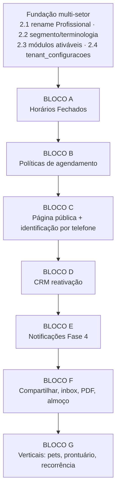

# Plano de Melhorias — Benchmark Ageendly → Nosso Sistema

> Documento de evolução do produto. Referências: `ANALISE_CONCORRENTE_AGEENDLY.md` (análise do concorrente), `ESPECIFICACAO.md` (produto), `MODELAGEM_BANCO.md` (banco), `ROADMAP_IMPLEMENTACAO.md` (progresso — Fases 1–3 concluídas, Fase 4 pendente).
>
> **Direção estratégica definida:** o Ageendly atende só barbearia e salão de beleza. Nós vamos focar em **barbearia agora**, mas com arquitetura preparada para expandir para **petshop, salão de beleza, clínica de estética, psicóloga, psiquiatra, dentista etc.** — setores que exigem módulos adicionais e regras de negócio variáveis por vertical.

---

## 1. Onde estamos vs. onde o Ageendly está

| Capacidade | Nosso sistema (hoje) | Ageendly | Veredito |
|---|---|---|---|
| Multi-tenant com isolamento | ✅ Global Scope + testes | ✅ | OK, paridade |
| Cadastros (clientes, profissionais, serviços, produtos) | ✅ CRUD completo | ✅ | OK, paridade |
| Agenda admin (criar/confirmar/cancelar) | ✅ | ✅ | OK, paridade |
| Comanda/venda + financeiro + comissão | ✅ | ✅ (mais simples que o nosso) | **Estamos à frente** |
| Dashboard com indicadores | ✅ | ✅ | Paridade (deles exporta PDF) |
| **Bloqueio de agenda ("Horários Fechados")** | ⚠️ Tabela `bloqueios_agenda` existe, mas **sem API, sem tela e a regra de conflito ignora bloqueios** | ✅ Seção própria no painel | **Gap — prioridade do usuário** |
| **Página pública de agendamento (slug)** | ❌ Não existe | ✅ É o coração do produto deles | **Gap crítico** |
| **Reconhecimento do cliente por telefone** | ❌ | ✅ (sem verificação — falha de segurança) | Gap — copiar **melhorando** |
| Área do cliente (ver/cancelar agendamentos) | ❌ | ✅ | Gap |
| Políticas de agendamento (janela, antecedência, cancelamento) | ❌ Nenhuma configuração | ✅ Por loja | Gap |
| CRM (inatividade, aniversariantes, banido, notas) | ⚠️ Só aniversários no dashboard | ✅ Filtros prontos p/ reativação | Gap |
| Notificações (confirmação, lembrete, aniversário, remarketing) | ❌ Fase 4 pendente | ✅ Push (WhatsApp nos planos pagos) | Gap |
| Compartilhamento (link, QR code, mensagem WhatsApp) | ❌ | ✅ | Gap |
| Site personalizado por loja (editor no-code) | ❌ | ✅ | Gap — v3, não copiar agora |
| Multi-setor (verticais além de beleza) | ❌ (mas é a nossa tese) | ❌ Só barbearia/salão | **Nossa oportunidade** |
| Pausa de almoço no expediente | ❌ `horarios_trabalho` não tem intervalo | ✅ | Gap pequeno |
| Pagamento/sinal antecipado | ❌ | ❌ | Oportunidade para ambos |

**Leitura geral:** nosso backend de gestão (comanda, financeiro, comissão) já é mais completo que o do Ageendly. O que nos falta é exatamente o que gera aquisição e retenção para eles: **a experiência pública do cliente final** (agendar em 15 segundos só com telefone) e as **automações de relacionamento**. Este plano fecha esses gaps e prepara o terreno multi-setor.

---

## 2. Fundação multi-setor (fazer ANTES dos novos módulos)

Tudo que construirmos daqui em diante deve nascer preparado para outras verticais. São 4 decisões de arquitetura, baratas agora e caras depois:

### 2.1 Renomear o domínio `Barbeiro` → `Profissional`

O nome "barbeiro" está cravado em tabela (`barbeiros`, `barbeiro_servico`), models, controllers, rotas e telas. Numa clínica ou petshop isso não para em pé.

- **Decisão recomendada:** renomear **agora**, enquanto o código tem 13 models e ~10 controllers. Custo: ~1 dia. Daqui a 6 meses: uma semana + risco de regressão.
- **Backend:** migration de rename (`barbeiros` → `profissionais`, `barbeiro_servico` → `profissional_servico`, FKs `barbeiro_id` → `profissional_id` em `agendamentos`, `comandas`, `horarios_trabalho`, `bloqueios_agenda`); renomear models/controllers/policies/requests/rotas (`/api/barbeiros` → `/api/profissionais`); atualizar factories/seeders/testes.
- **Frontend:** renomear views/rotas/menus. O **rótulo visível** ao usuário passa a vir da terminologia do segmento (ver 2.2) — na barbearia continua aparecendo "Barbeiros".
- **Pronto quando:** todos os testes passam e a tela da barbearia continua exibindo "Barbeiro" via terminologia, com o código 100% neutro.

### 2.2 Segmento do tenant + terminologia dinâmica

- **Backend:** coluna `tenants.segmento` (string: `barbearia`, `salao`, `petshop`, `clinica_estetica`, `psicologia`, `psiquiatria`, `odontologia`, ...). Um arquivo de configuração `config/segmentos.php` define, por segmento, a terminologia e os módulos padrão:

```php
'barbearia' => [
    'terminologia' => [
        'profissional' => 'Barbeiro',
        'profissionais' => 'Barbeiros',
        'cliente' => 'Cliente',
        'atendimento' => 'Atendimento',
    ],
    'modulos_padrao' => ['agendamento', 'comandas', 'produtos', 'financeiro'],
],
'psicologia' => [
    'terminologia' => ['profissional' => 'Psicólogo(a)', ...],
    'modulos_padrao' => ['agendamento', 'financeiro', 'recorrencia'],
],
```

- O endpoint `/api/user` (ou um novo `/api/tenant/contexto`) devolve `segmento`, `terminologia` e `modulos_ativos` junto com o usuário logado.
- **Frontend:** um composable `useTerminologia()` lê o mapa do store e substitui os rótulos fixos (menu, títulos, botões). Nenhuma tela imprime "Barbeiro" hardcoded.
- **Pronto quando:** trocar o segmento de um tenant de teste no banco muda os rótulos de toda a interface sem tocar em código.

### 2.3 Módulos ativáveis por tenant (feature flags)

Verticais diferentes precisam de módulos diferentes (petshop precisa de "Pets"; psicóloga não precisa de "Produtos/estoque"). Em vez de esconder na mão:

- **Backend:** coluna JSON `tenants.modulos_ativos` (ex.: `["agendamento","comandas","produtos","financeiro","bloqueios"]`), inicializada pelos `modulos_padrao` do segmento no onboarding. Um middleware/Gate `modulo:produtos` protege as rotas de cada módulo (rota de módulo desativado → 403). O plano de assinatura também pode restringir módulos (interseção plano ∩ segmento).
- **Frontend:** o menu lateral e as rotas do Vue Router são montados a partir de `modulos_ativos` (guard de rota + `v-if` no menu). Um módulo desativado simplesmente não existe para aquele tenant.
- **Pronto quando:** desativar `produtos` num tenant faz sumir o item do menu, a rota redireciona e a API responde 403 — sem nenhum outro código alterado.

### 2.4 Configurações/regras de negócio por tenant (key-value)

Regras que variam por loja e por vertical não podem ser colunas soltas espalhadas. Criar uma tabela única:

- **Backend:** tabela `tenant_configuracoes` (`tenant_id`, `chave` varchar, `valor` jsonb, unique por tenant+chave) + um serviço `TenantConfig::get('agendamento.antecedencia_minima_min', $default)` com cache. As políticas do Bloco B usam essa tabela.
- Isso também é o lugar natural para regras futuras por vertical (ex.: `clinica.exige_anamnese = true`, `psicologia.duracao_sessao_fixa = 50`).
- **Pronto quando:** existe endpoint `GET/PUT /api/tenant/configuracoes` (admin) e o serviço com cache é usado por pelo menos uma regra real.

---

## 3. Blocos de melhoria (com passos back/front)

Ordenados por prioridade. Cada bloco fecha um gap do comparativo da seção 1.

---

### 🔒 BLOCO A — Horários Fechados (bloqueio de agenda) — *pedido explícito*

O que o Ageendly tem e você gostou: o profissional fecha a agenda num feriado, num dia ou num período de um dia, com motivo. **Nós já temos a tabela `bloqueios_agenda` modelada e migrada** (`tenant_id`, `barbeiro_id` nulo = loja toda, `data_inicio`, `data_fim`, `motivo`) — falta tudo em volta dela.

**Passo A1 — API de bloqueios (backend)**
- `BloqueioAgendaController` REST (`index` com filtro por período/profissional, `store`, `update`, `destroy`) + `BloqueioAgendaRequest` + Policy (admin: gerencia todos; profissional: gerencia **apenas os próprios**, igual ao padrão já usado em `horarios-trabalho`).
- Regras de validação: `data_fim > data_inicio`; avisar (não impedir) se já existem agendamentos confirmados dentro do período — o response de `store` retorna a lista de agendamentos afetados para o front decidir o que fazer.
- Suporte aos dois alvos: bloqueio do profissional (`profissional_id` preenchido) e **bloqueio da loja inteira** (`profissional_id = null`, ex.: feriado — só admin pode criar).
- Rota: `Route::apiResource('bloqueios-agenda', ...)`.

**Passo A2 — Integrar bloqueios na regra de disponibilidade (backend) — o mais importante**
- Hoje `Agendamento::conflita()` só olha sobreposição com outros agendamentos. Criar um serviço central **`DisponibilidadeService`** que responde "este profissional pode atender neste intervalo?" combinando **3 camadas**: (1) expediente (`horarios_trabalho`), (2) bloqueios (`bloqueios_agenda`, do profissional **ou** da loja), (3) conflito com agendamentos existentes.
- `AgendamentoController@store/update` passa a usar o serviço (erro 422 com mensagem específica: "fora do expediente", "agenda fechada neste período: {motivo}", "horário já ocupado").
- Esse serviço é o mesmo que vai alimentar a página pública (Bloco C) — construir uma vez, usar nos dois lugares.
- **Pronto quando:** teste automatizado cobre os 3 motivos de recusa + criar agendamento dentro de um bloqueio da loja falha mesmo vindo do admin.

**Passo A3 — Tela "Fechar Agenda" (frontend)**
- Nova view `BloqueiosView.vue` no menu (item "Fechar Agenda" ou "Horários Fechados"), padrão tabela + modal Preline já usado nas outras telas.
- Modal de criação com: alvo (eu / profissional X / loja inteira — conforme papel), tipo rápido (**Dia inteiro** ou **Período do dia**), data(s), hora início/fim (habilitadas só no tipo período), motivo (texto livre + sugestões rápidas: Feriado, Folga, Férias, Compromisso pessoal, Manutenção).
- Se a API retornar agendamentos afetados, mostrar modal de confirmação listando-os ("Existem 3 agendamentos neste período — deseja fechar mesmo assim?").
- Na `AgendaView` existente, renderizar os períodos bloqueados como faixas visuais (cinza/hachurado) com o motivo.
- **Pronto quando:** barbeiro fecha "amanhã o dia todo — Folga", o dia some da disponibilidade e o admin vê a faixa na agenda.

**Passo A4 — Bloqueios recorrentes (opcional, v2 do bloco)**
- Campo `recorrencia` (jsonb, ex.: toda segunda-feira) para casos como "não atendo às segundas de manhã" sem poluir `horarios_trabalho`. Deixar a coluna prevista, implementar depois.

---

### ⚙️ BLOCO B — Políticas de agendamento por tenant

Copiar a seção "Agendamento e Privacidade" do Ageendly, usando a fundação 2.4:

| Chave | Efeito |
|---|---|
| `agendamento.janela_dias` | Até quantos dias no futuro o cliente pode marcar (ex.: 30) |
| `agendamento.antecedencia_minima_min` | Quanto tempo antes o cliente pode marcar (ex.: 30 min) |
| `agendamento.permite_cancelamento` | Cliente pode cancelar sozinho? |
| `agendamento.antecedencia_cancelamento_min` | Até quanto tempo antes pode cancelar |
| `loja.publica` | Página pública no ar ou não |

**Passo B1 (backend):** validar essas regras no `DisponibilidadeService` (para slots exibidos) e nos endpoints públicos de criação/cancelamento (Bloco C). Regras **não** se aplicam ao admin criando manualmente.
**Passo B2 (frontend):** seção "Políticas de Agendamento" na futura tela de Configurações da Loja (selects com presets: 5/15/30 min, 1/2/4/12/24 h, 2/7 dias — igual ao concorrente, que acertou na simplicidade).
**Pronto quando:** com antecedência mínima de 2 h, o slot de daqui a 1 h não aparece na página pública, mas o admin ainda consegue encaixar manualmente.

---

### 🌐 BLOCO C — Página pública de agendamento (o gap mais crítico)

É o coração do modelo do Ageendly e já está previsto na nossa especificação (slug do tenant) — só nunca foi construído. Fluxo alvo, copiando o que funciona e **corrigindo a falha de segurança deles**:

**Passo C1 — Endpoints públicos (backend)**
- Grupo de rotas **sem auth** com throttle: 
  - `GET /api/public/{slug}/loja` — dados da loja, serviços ativos (nome, preço, duração), profissionais ativos.
  - `GET /api/public/{slug}/disponibilidade?servicos[]=1&servicos[]=2&profissional_id=&data=` — slots livres do dia, calculados pelo `DisponibilidadeService` (soma das durações dos serviços define o tamanho do slot; sem profissional escolhido, união dos horários de todos que fazem aqueles serviços).
  - `POST /api/public/{slug}/agendamentos` — cria agendamento `pendente` (ou `confirmado`, config do tenant).
  - `POST /api/public/{slug}/identificar` — recebe telefone; responde `{ cliente_existe: true/false }` (**sem retornar o nome** — ver C3).
- Concorrência: criação dentro de transação com lock (`SELECT ... FOR UPDATE` no intervalo do profissional) re-validando disponibilidade — dois clientes não podem fechar o mesmo slot.

**Passo C2 — Identificação por telefone com fricção mínima**
- Fluxo do cliente: serviços → data/horário → **telefone** → (nome, só se telefone desconhecido) → confirmado. Máscara brasileira no input, normalizar para E.164 (`+55...`) no banco.
- Cliente reconhecido pelo telefone **no servidor** (busca em `clientes.telefone` do tenant): pula a etapa de nome — o comportamento que você viu e gostou.
- Após criar, gravar cookie/localStorage com um token de sessão do cliente para a próxima visita pular também o telefone ("Olá, Carlos! 👋 — *Não é você?*").

**Passo C3 — Verificação leve (nosso diferencial de segurança sobre eles)**
- O Ageendly loga qualquer pessoa que digite o telefone de outra — dá acesso a histórico e cancelamentos. **Não copiar isso.**
- Regra nossa: digitar um telefone já cadastrado permite **criar** o agendamento normalmente (fricção zero mantida — o risco de criar agendamento em nome de outro é baixo e o dono vê tudo), mas **ver histórico/cancelar/editar dados exige verificação por código** (OTP via WhatsApp/SMS — integração do Bloco E; enquanto não houver canal, um link mágico simples). Sessão verificada dura ~90 dias no dispositivo.
- `POST /api/public/{slug}/identificar` **nunca** retorna nome/dados do cliente para telefone não verificado — apenas `cliente_existe`.
- Estrutura: tabela `cliente_sessoes` (`cliente_id`, `token` hash, `verificado_em`, `expira_em`, `user_agent`).

**Passo C4 — SPA pública (frontend)**
- Rotas públicas no Vue Router: `/{slug}` (landing simples da loja: nome, logo, endereço, serviços com preço/duração e botão Agendar) e o wizard de agendamento em modal/página (4 passos, mobile-first — o cliente final é 90% celular).
- Tela de confirmação com os 3 atalhos que o Ageendly acertou: **Adicionar ao Google Calendar** (link `calendar.google.com/render?action=TEMPLATE&...`), **Falar com o profissional no WhatsApp** (`wa.me/{telefone}?text=...` pré-preenchido) e **Cancelar agendamento** (respeitando política do Bloco B).
- Área "Meus agendamentos" (`/{slug}/conta`): futuros + histórico + dados básicos, atrás da verificação do C3.
- **Pronto quando:** um cliente sem cadastro agenda pelo celular em menos de 30 segundos; um telefone já conhecido pula o nome; ninguém acessa o histórico de outra pessoa sem o código.

---

### 📇 BLOCO D — CRM: reativação e relacionamento

O filtro **"Sem agendar há X dias"** do Ageendly é a melhor ideia de CRM deles — transforma a lista de clientes em ferramenta de receita.

**Passo D1 (backend):** no `ClienteController@index`, filtros: `?sem_agendar_ha_dias=30` (clientes cujo último agendamento concluído é mais antigo que X — subquery no último `agendamentos.data_hora_inicio`), `?aniversariantes=mes_atual|semana`, `?ativo=`. Adicionar em `clientes`: `banido` (boolean), `notificacoes_ativas` (boolean), `dias_remarketing` (int nulo — override por cliente).
**Passo D2 (backend):** endpoint `GET /clientes/{id}/metricas` — ticket médio, total gasto, nº de atendimentos, nº de cancelamentos, serviços mais consumidos (dados que já temos em comandas/agendamentos).
**Passo D3 (frontend):** `ClientesView`: chips de filtro (Ativos / Aniversariantes / Sem agendar há [select]); perfil do cliente em drawer/página com métricas do D2, campo de **observações privadas** (já existe a coluna) com aviso "o cliente não vê isso", toggles banido/notificações.
**Passo D4:** cliente banido não consegue agendar pela página pública (mensagem genérica de indisponibilidade).
**Pronto quando:** o dono filtra "sem agendar há 30 dias" e vê a lista pronta para chamar no WhatsApp (botão de atalho `wa.me` por cliente na listagem).

---

### 🔔 BLOCO E — Notificações e automações (Fase 4 do roadmap, enriquecida)

A Fase 4 já previa a camada abstrata de canais. Com o benchmark, definimos **o que** ela dispara — copiar a matriz de eventos do Ageendly, que é completa:

| Evento | Destinatário | Gatilho |
|---|---|---|
| Confirmação de agendamento | Cliente + Profissional | Ao criar (público ou admin) |
| Lembrete de agendamento | Cliente | Scheduler, X horas antes (config do tenant) |
| Cancelamento | Cliente + Profissional | Ao cancelar |
| Aniversário | Cliente | Scheduler diário (podendo incluir cupom/desconto — v2) |
| **Remarketing** ("sentimos sua falta") | Cliente | Scheduler diário: sem agendar há `dias_remarketing` (do cliente, ou padrão da loja) |

- **Passo E1 (backend):** implementar Web Push primeiro (como já planejado) + os 5 eventos acima como Notifications/Jobs; cada evento com toggle on/off em `tenant_configuracoes` (`notificacoes.lembrete.ativo`, `notificacoes.lembrete.antecedencia_horas`, ...).
- **Passo E2 (frontend):** tela "Notificações" (menu Configurar Lembretes) com os toggles por evento, em duas seções (para profissionais / para clientes) — layout igual ao deles, que é claro.
- **Passo E3 (canal WhatsApp):** manter a decisão pendente de provedor, mas **antes do provedor pago** já dá para entregar valor com links `wa.me` manuais (botão "cobrar confirmação no WhatsApp" na agenda do admin gera a mensagem pronta). WhatsApp automático vira feature de plano pago (mesma segmentação de preço do concorrente).
- **Pronto quando:** cliente agenda pela página pública e o profissional recebe push na hora; scheduler de lembrete/aniversário/remarketing roda em teste com data simulada.

---

### 📣 BLOCO F — Divulgação e profissionalização do painel

Itens menores, alto impacto percebido ("cara de produto"):

- **Passo F1 — Compartilhar:** tela com o link público (`nosso-dominio.com/{slug}`), botão copiar, **QR code** (gerar no front com `qrcode` npm — sem custo de API), botão "Compartilhar no WhatsApp" com mensagem template editável (variáveis `{nome_loja}` e `{link}` — igual ao deles).
- **Passo F2 — Slug editável:** campo para o dono personalizar o slug (validação de unicidade + redirecionamento do antigo por um período).
- **Passo F3 — Caixa de entrada:** feed de eventos do tenant ("Paula agendou Corte hoje às 15:30", "João cancelou") — tabela `inbox_eventos` alimentada pelos mesmos eventos do Bloco E, ícone de sino com contador no header.
- **Passo F4 — Exportar relatório em PDF:** no Financeiro/Dashboard, botão "Exportar PDF" (ex.: `spatie/laravel-pdf` ou browsershot; alternativa leve: `barryvdh/laravel-dompdf`). Período e profissional como filtros, mesmo layout dos cards.
- **Passo F5 — Pausa de almoço no expediente:** adicionar `intervalo_inicio`/`intervalo_fim` (nullable) em `horarios_trabalho`, considerar no `DisponibilidadeService`, e editar na tela de horários do profissional.
- **Passo F6 — Onboarding guiado:** checklist pós-cadastro no dashboard ("① Cadastre seus serviços ② Defina seu expediente ③ Compartilhe seu link") com progresso — o aviso proativo do Ageendly ("configure X para o site ficar completo") é um bom padrão.

---

### 🧩 BLOCO G — Módulos por vertical (a expansão — desenhar agora, construir depois)

Com a fundação da seção 2, cada vertical vira um **módulo plugável** + terminologia + regras. Mapa do que cada setor vai exigir, para nenhuma decisão de agora atrapalhar depois:

| Vertical | Módulo(s) novo(s) | Impacto no core |
|---|---|---|
| **Petshop** | `pets`: cadastro de pets do cliente (nome, espécie, porte, raça, observações); agendamento ganha `pet_id` opcional | FK nullable em `agendamentos` — inofensiva para os demais |
| **Clínica de estética / dentista** | `prontuario`: fichas de anamnese por cliente (formulário configurável via JSON), anexos/fotos, termo de consentimento | Tabelas novas; agendamento pode exigir ficha preenchida (regra em `tenant_configuracoes`) |
| **Psicóloga / psiquiatra** | `recorrencia`: agendamento recorrente (toda terça às 14h), sessão com duração fixa, link de teleconsulta | Coluna `recorrencia_id` em agendamentos + geração de ocorrências futuras; privacidade reforçada (LGPD/sigilo) |
| **Dentista / psiquiatra** | `convenios`: convênio/plano de saúde por cliente, valor por convênio | Override de preço por convênio na comanda |
| Todos os clínicos | Regra "cliente não escolhe profissional livremente" ou "1 serviço por agendamento" | Flags em `tenant_configuracoes`, lidas pela página pública |

**Regras de projeto para não se machucar depois:**
1. Nenhum módulo novo altera coluna existente — só adiciona tabelas/colunas nullable.
2. Página pública lê tudo de config: nº máximo de serviços por agendamento, se escolhe profissional, se pede pet, se exige ficha — **o wizard público é montado por configuração**, não por `if (segmento === 'petshop')` espalhado.
3. Comanda/financeiro continuam universais (qualquer vertical fecha atendimento e lança receita) — é a nossa vantagem sobre o Ageendly, preservá-la.

---

## 4. Ordem de execução sugerida



| Ordem | Entrega | Por quê nessa posição |
|---|---|---|
| 1 | **Fundação (seção 2)** | Barata agora, cara depois; tudo abaixo depende dela |
| 2 | **Bloco A — Horários Fechados** | Pedido explícito; tabela já existe; o `DisponibilidadeService` criado aqui é pré-requisito do Bloco C |
| 3 | **Bloco B — Políticas** | Pequeno; precisa existir antes da página pública para os slots respeitarem as regras |
| 4 | **Bloco C — Página pública** | Maior gap competitivo; é o que faz o sistema "vender sozinho" |
| 5 | **Bloco D — CRM** | Rápido (colunas + filtros) e prepara o remarketing |
| 6 | **Bloco E — Notificações** | Era a Fase 4; agora com matriz de eventos definida e dependendo do CRM (remarketing) |
| 7 | **Bloco F — Profissionalização** | Polimento contínuo, pode intercalar com os anteriores |
| 8 | **Bloco G — Verticais** | Só depois do core redondo para barbearia; começar por **petshop** (módulo mais simples: só `pets`) |

---

## 5. O que decidimos NÃO copiar (e por quê)

| Recurso do Ageendly | Decisão | Motivo |
|---|---|---|
| Login do cliente sem verificação nenhuma | ❌ Não copiar | Falha de segurança/LGPD documentada na análise — nossa versão usa verificação leve só para dados sensíveis (C3), mantendo a fricção zero no agendamento |
| Editor de site no-code completo (templates, cores, chatbot) | ⏸️ Adiar (v3) | Custo altíssimo; nossa landing pública simples (C4) cobre 80% do valor. Reavaliar quando houver tração |
| Chatbot no site | ⏸️ Adiar | Sem evidência de valor no nicho ainda |
| Push como único canal grátis | ❌ Melhorar | Push é frágil no público BR; nossos links `wa.me` manuais (E3) entregam WhatsApp "de graça" desde o dia 1 |
| Restrição a 2 segmentos | ❌ É justamente nossa tese inversa | Multi-setor com módulos é o diferencial competitivo do nosso produto |

---

## 6. Resumo executivo

1. **Fundação primeiro:** neutralizar o domínio (Profissional), segmento + terminologia + módulos por tenant, configurações key-value. É o que torna a expansão multi-setor possível sem reescrita.
2. **Horários Fechados** (seu pedido): a tabela já existe — falta API, integração na regra de disponibilidade (criando o `DisponibilidadeService`, peça central de tudo) e a tela com "dia inteiro / período / loja toda + motivo".
3. **Página pública de agendamento** é o gap mais crítico frente ao concorrente: fluxo de 4 passos com identificação por telefone (pulando o nome para cliente conhecido, como o deles), mas com verificação leve para dados sensíveis — corrigindo a falha grave de segurança que encontramos neles.
4. **CRM de reativação + notificações automáticas** (lembrete, aniversário, remarketing) fecham o ciclo de retenção.
5. **Verticais** entram por último, como módulos plugáveis (petshop primeiro), sobre um core que já estará genérico.
