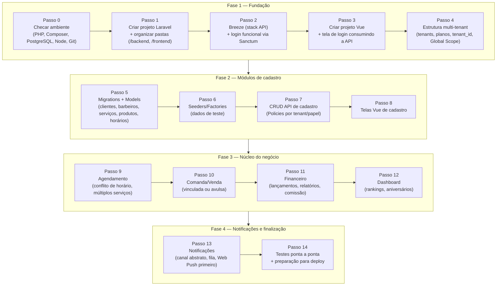

# Roadmap de Implementação

> Ordem sugerida para começar a codar. Referências: `ESPECIFICACAO.md` (produto) e `MODELAGEM_BANCO.md` (banco de dados).

Decisões que moldam este roadmap:
- **Frontend:** SPA Vue separada (não Inertia), consumindo o Laravel só como API REST (Breeze stack "API" + Sanctum).
- **Pastas:** monorepo único, com `/backend` (Laravel) e `/frontend` (Vue/Vite) na raiz.

## Checklist de progresso

**Fase 1 — Fundação**
- [x] Passo 0 — Checar ambiente
  - [x] PHP 8.3.13 existe e funciona (Laragon) — PATH de usuário já está certo, mas **sessões novas de terminal/Claude Code podem herdar o PATH antigo (7.4)** até reiniciar a nível de SO. Decisão: manter assim, sem reiniciar o SO por enquanto. Workaround aceito: no início de cada sessão, checar `php -v`; se vier 7.4, alertar e corrigir o `$env:Path` só daquela sessão com:
    ```powershell
    $env:Path = $env:Path -replace [regex]::Escape("C:\laragon\bin\php\php-7.4.33-nts-Win32-vc15-x64"), "C:\laragon\bin\php\php-8.3.13-nts-Win32-vs16-x64"
    ```
  - [x] Composer 2.4.1 OK
  - [x] PostgreSQL resolvido via container Docker `esus-db` (porta 5433), banco `agenda_barbearia` criado
  - [x] Node.js / npm / Git OK
- [x] Passo 1 — Criar projeto Laravel e organizar pastas
  - [x] Projeto Laravel criado em `/backend` (Laravel v13.8.0 / framework v13.16.1)
  - [x] `.env` configurado para PostgreSQL (host 127.0.0.1:5433, banco `agenda_barbearia`, container `esus-db`) — `php artisan migrate` rodou com sucesso
  - [x] Pasta `/frontend` criada (vazia, com `.gitkeep`)
  - [x] Git inicializado na raiz do monorepo — ainda sem commit inicial
- [x] Passo 2 — Breeze (stack API) + login funcional — testado via curl (register, login, logout) com cookie de sessão + Sanctum stateful; trait `HasApiTokens` adicionado ao model `User`
- [x] Passo 3 — Criar projeto Vue + tela de login — Vite (porta 3000) + Vue Router + Axios com `withCredentials`/`withXSRFToken`; fluxo Sanctum SPA (csrf-cookie → login → `/api/user`) testado no navegador (login, persistência de sessão em reload, logout)
- [x] Passo 4 — Estrutura multi-tenant — migrations `planos`/`tenants` + `tenant_id`/`tipo`/`telefone` em `users`; `App\Tenancy\CurrentTenant` (singleton), `BelongsToTenant` (trait + Global Scope, auto-preenche `tenant_id` e lança `TenantContextMissingException` se nenhum tenant foi resolvido) e middleware `ResolveTenant` (resolve por slug de rota ou pelo tenant do usuário autenticado, registrado no grupo `api`); seeds de 2 planos + 2 tenants + 1 admin por tenant + 1 super_admin; isolamento validado por testes automatizados (`tests/Feature/Tenancy/*`)

**Fase 2 — Módulos de cadastro**
- [x] Passo 5 — Migrations + Models de cadastro — tabelas `clientes`, `barbeiros`, `servicos`, `produtos`, `barbeiro_servico` (pivot com override de comissão/preço), `horarios_trabalho`, `bloqueios_agenda`; models Eloquent com os relacionamentos entre si e `BelongsToTenant` nas que têm `tenant_id` (todas exceto `horarios_trabalho`, escopada indiretamente via `barbeiro`); isolamento validado em `tests/Feature/Tenancy/CadastroModelsTenantScopeTest.php`
- [x] Passo 6 — Seeders/Factories — factories para `Plano`, `Tenant`, `Cliente`, `Barbeiro` (com `User` vinculado), `Servico`, `Produto`, `HorarioTrabalho`; `CadastroSeeder` popula cada tenant com 2 barbeiros, 4 serviços, 3 produtos, 6 clientes e expediente seg-sex
- [x] Passo 7 — CRUD API de cadastro — Policies (`admin` = CRUD completo; `prestador_de_servico` = leitura, e gestão do próprio horário de trabalho), Form Requests combinando validação + autorização, controllers REST (`clientes`, `servicos`, `produtos`, `barbeiros`, `barbeiros/{barbeiro}/horarios-trabalho`); isolamento por tenant garantido pelo Global Scope já em model binding — acesso cross-tenant retorna 404 automaticamente. **Bug encontrado e corrigido:** `ResolveTenant` rodava depois do `SubstituteBindings` do Laravel (prioridade de middleware), então rotas com `{barbeiro}` etc. quebravam com tenant não resolvido; corrigido via `Middleware::prependToPriorityList` em `bootstrap/app.php`. 32 testes automatizados cobrindo CRUD, papéis e isolamento
- [x] Passo 8 — Telas Vue de cadastro — páginas `Clientes`, `Barbeiros` (com gestão de horários por barbeiro), `Serviços` e `Produtos` dentro de um `AppLayout` com navegação; consomem a API do Passo 7 via `src/api/cadastro.js`. Testado no navegador de ponta a ponta contra o backend real (Postgres): login como admin, criar/editar/excluir cliente, criar barbeiro com conta de usuário vinculada, editar comissão/ativo inline, adicionar/remover horário de trabalho, listar serviços/produtos semeados. **Pronto (Fase 2):** confirmado manualmente — admin cadastra barbeiros/serviços/produtos pela tela e os dados aparecem corretamente filtrados por tenant.

**Nota para depois:** excluir um barbeiro remove o registro de `barbeiros` mas não a `User` (`prestador_de_servico`) vinculada — fica órfã. Não afeta o fluxo atual, mas vale revisitar ao tratar gestão de usuários.

**Fase 3 — Núcleo do negócio**
- [x] Passo 9 — Agendamento — migrations `agendamentos`/`agendamento_servico`; `data_hora_fim` calculada a partir da soma de `duracao_minutos` dos serviços escolhidos; `Agendamento::conflita()` bloqueia sobreposição de horário para o mesmo barbeiro (create e update); Policy (`admin` = tudo; `prestador_de_servico` = só a própria agenda); tela `AgendaView` (criar, confirmar, cancelar, "criar comanda"). Testado no navegador: agendamento criado com duração correta.
- [x] Passo 10 — Comanda/Venda — migrations `comandas`/`comanda_itens`; abrir comanda a partir de um agendamento (pré-popula itens com o preço congelado) ou avulsa; endpoints para adicionar/remover item (ajusta estoque de produto automaticamente) e para fechar (define forma de pagamento, congela `valor_total`, gera lançamento no financeiro, marca o agendamento como concluído); telas `ComandasView`/`ComandaDetailView`.
- [x] Passo 11 — Financeiro — migration `financeiro_lancamentos`; CRUD restrito a `admin`; endpoint de relatório por período (receitas/despesas/saldo) com comissão por barbeiro calculada em tempo real (`comanda_itens` × `barbeiro_servico.comissao_percentual` ou `comissao_percentual_padrao`, sem tabela própria); tela `FinanceiroView`.
- [x] Passo 12 — Dashboard — endpoint agregando produtos/serviços mais vendidos, ranking de barbeiros por faturamento, clientes mais frequentes e próximos aniversários (calculado em PHP para funcionar igual em SQLite/Postgres); `DashboardView` atualizada com os widgets.

**Bugs encontrados e corrigidos durante os testes:**
- Duas migrations novas (`agendamento_servico`, `comanda_itens`) ordenavam antes das tabelas que referenciam (`_` vem antes de `s` na ordenação alfabética de timestamps iguais) — renomeadas com timestamp 1s à frente.
- `ComandaItem` apontava para a tabela errada (`comanda_items` em vez de `comanda_itens`) — mesmo padrão do `HorarioTrabalho`/`BloqueioAgenda` na Fase 2.
- `ComandaController` não carregava `itens.servico`/`itens.produto`, então a tela mostrava o nome do item em branco — pego testando no navegador.
- `ComandaItemRequest`: enviar `servico_id`/`produto_id` como `null` explícito (em vez de omitir) falhava a regra `integer` por faltar `nullable` — pego testando no navegador ao adicionar um produto.

**Nota de simplificação:** a "data de fechamento" usada no relatório financeiro (comissão por período) é o `updated_at` da comanda paga, já que não existe uma coluna própria de data de pagamento — suficiente para o uso atual, mas vale revisitar se `updated_at` passar a ser tocado por outras razões.

**Escopo não incluído nesta fase:** a tela pública de agendamento pelo próprio cliente (sem login, via slug do tenant) não foi construída — o Passo 9 cobre apenas a visão admin/barbeiro (criar/editar/cancelar agendamento manualmente), que é o que valida o ciclo completo pedido no critério de "Pronto" da fase.

**Fase 4 — Notificações e finalização**
- [ ] Passo 13 — Notificações
- [ ] Passo 14 — Testes ponta a ponta + deploy

## Diagrama



## Descrição de cada passo

### Fase 1 — Fundação

**Passo 0 — Checar ambiente**
Confirmar que estão instalados e em versões compatíveis: PHP 8.3+, Composer, PostgreSQL (servidor rodando + client `psql`), Node.js/npm (para o Vue) e Git.
Comandos: `php -v`, `composer -V`, `psql --version`, `node -v`, `npm -v`, `git --version`.

**Passo 1 — Criar projeto Laravel e organizar pastas**
`composer create-project laravel/laravel backend` na raiz do monorepo. Configurar `.env` para PostgreSQL (`DB_CONNECTION=pgsql`). Criar a pasta `/frontend` (vazia por enquanto). Inicializar Git na raiz.
**Pronto quando:** `php artisan serve` sobe sem erro e `php artisan migrate` conecta no PostgreSQL.

**Passo 2 — Breeze (stack API) + login funcional**
`composer require laravel/breeze --dev` e `php artisan breeze:install api`. Rodar as migrations padrão (`users`). Testar registro/login/logout via Sanctum usando Postman/Insomnia ou `curl` — ainda sem frontend.
**Pronto quando:** conseguir registrar um usuário e logar, recebendo a sessão/token autenticado.

**Passo 3 — Criar o projeto Vue e conectar ao login**
`npm create vite@latest` dentro de `/frontend` (template Vue). Configurar Axios + Sanctum (CSRF cookie). Montar tela de login/registro consumindo a API do Passo 2.
**Pronto quando:** logar pelo navegador e ver a sessão autenticada refletida na SPA.

**Passo 4 — Estrutura multi-tenant**
Migrations de `planos` e `tenants`. Adicionar `tenant_id` em `users`. Criar Global Scope + Middleware para resolver o tenant atual (via slug na URL). Seed de 1–2 tenants de teste.
**Pronto quando:** dois usuários de tenants diferentes não conseguem ver dados um do outro.

### Fase 2 — Módulos de cadastro

**Passo 5 — Migrations + Models de cadastro**
Criar as tabelas `clientes`, `barbeiros`, `servicos`, `produtos`, `barbeiro_servico`, `horarios_trabalho`, `bloqueios_agenda`, todas com `tenant_id` e Global Scope, conforme `MODELAGEM_BANCO.md`.

**Passo 6 — Seeders/Factories**
Popular um tenant de teste com admin, barbeiros, serviços, produtos e clientes — para já existir dado real ao testar os passos seguintes.

**Passo 7 — CRUD API de cadastro**
Endpoints REST de clientes, barbeiros, serviços, produtos e horários, com Policies/Form Requests garantindo isolamento por tenant e por papel de usuário.

**Passo 8 — Telas Vue de cadastro**
Páginas de listagem/criação/edição para cada módulo do Passo 7.
**Pronto (Fase 2) quando:** um admin consegue cadastrar barbeiros, serviços e produtos pela tela, e os dados aparecem corretamente filtrados pelo tenant.

### Fase 3 — Núcleo do negócio

**Passo 9 — Agendamento**
Migrations `agendamentos` + `agendamento_servico`. Regra de conflito de horário (mesmo barbeiro, mesmo intervalo). Endpoints de criar/editar/cancelar. Tela de agenda (visão cliente e visão admin/barbeiro).

**Passo 10 — Comanda/Venda**
Migrations `comandas` + `comanda_itens`. Endpoint para fechar atendimento (vinculado a um agendamento ou avulso). Tela de "fechar comanda".

**Passo 11 — Financeiro**
`financeiro_lancamentos` para despesas/receitas extras. Relatórios por período. Cálculo de comissão derivado de `comanda_itens` (sem tabela própria de comissão).

**Passo 12 — Dashboard**
Queries agregadas: produtos/serviços mais vendidos, ranking de barbeiros, clientes mais frequentes, próximos aniversários. Tela de dashboard.
**Pronto (Fase 3) quando:** dá para agendar, fechar a comanda, ver o valor entrar no financeiro e aparecer no dashboard — o ciclo completo de um atendimento.

### Fase 4 — Notificações e finalização

**Passo 13 — Notificações**
Camada abstrata de canais (interface comum), Jobs em fila (Laravel Queue) para envio assíncrono. Implementar Web Push primeiro (mais simples de testar localmente, sem depender de provedor externo). WhatsApp fica como stub plugável — provedor real (Meta Cloud API ou terceirizado) entra depois.

**Passo 14 — Testes ponta a ponta e preparação para deploy**
Percorrer os fluxos principais com cada papel de usuário (super_admin, admin, barbeiro, cliente). Ajustar variáveis de ambiente de produção. Build do Vue (`npm run build`).

---

## Atualização — 2026-10-03: migração para Next.js

As Fases 1–3 acima foram implementadas originalmente em Laravel + Vue e depois **migradas para uma aplicação Next.js full-stack em `web/`**, com paridade funcional ([ADR-0001](decisions/0001-migracao-full-stack-nextjs.md); `TASK-0001`…`TASK-0019` em [`tasks/`](tasks/)). O legado (`backend/`, `frontend/`) foi removido e continua no histórico do Git (commit `7446d48`). Os caminhos e comandos citados nas fases acima (`php artisan`, `/backend`, `/frontend`) são históricos. Para a stack atual, veja o [`AGENTS.md`](../AGENTS.md) raiz e o [`web/AGENTS.md`](../web/AGENTS.md).

Além da paridade, a migração trouxe correções e melhorias registradas nas ADRs 0003–0011: fuso horário por barbearia, travas contra agendamento duplo e contra fechar comanda duas vezes, estoque nunca negativo, uma comanda por agendamento, profissional desativado em vez de excluído, isolamento por tenant que inclui os horários de trabalho e data real de pagamento nas comissões.

**Fase 4 — Notificações e finalização** continua pendente e será construída na stack nova.
